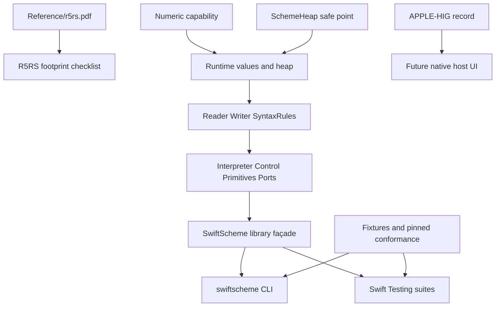

# ADR-0001: R5RS-guided runtime topology and Swift Testing migration

- Status: Proposed
- Date: 2026-08-14
- Deciders: SwiftScheme maintainers (root owner), architecture-design and architecture-enforce owners, test owner, Apple-platform design owner
- Supersedes / superseded by: none
- Related: OBJ-001, REQ-001, REQ-002, QA-001, QA-002, QA-003, QA-004, QA-005

## Task Contract

**OBJ-001** is to keep a compact, correct Swift 6+ implementation whose language
contract is read from the repository's `Reference/r5rs.pdf`. **REQ-001** requires
Swift 6.3.3 and Swift Package Manager. **REQ-002** requires Swift Testing only;
XCTest (including a local compatibility implementation) is not a supported
long-term test dependency. The existing CLI contract and public library API are
preserved while the topology is migrated. This record is architecture guidance,
not a claim that the implementation is R5RS-complete. The narrow current
package/no-XCTest/no-native-UI contract is enforced by the repository-local
`Scripts/check-architecture.py` gate; broader capability ownership remains an
architecture decision and review responsibility.

## Evidence

The current snapshot below is anchored to final architecture candidate
`9f954c6` (syntax-aware no-native-UI import gate, descended from predecessor
`22b9a62` and semantic checkpoint `e89c237`) on 2026-08-14. Historical
observations are explicitly labeled and are retained only to explain the
migration; they are not current package evidence.

- **Historical baseline (pre-migration):** `swift --version` reported Apple
  Swift 6.3.3. The pre-migration `swift package dump-package` graph reported
  package `SwiftScheme`, macOS v14, library product `SwiftScheme`, executables
  `swiftscheme` and `swiftscheme-selftest`, regular targets `SwiftScheme` and
  `XCTest`, executable targets `SwiftSchemeCLI`, `SwiftSchemeSelfTests`, and
  `SwiftSchemeTestTool`, plus `SwiftSchemeTestPlugin` and
  `SwiftSchemePackageTestTarget`.
- **Historical baseline (pre-migration):** `Package.swift:1-50` was the
  canonical package graph. The library target path was `Sources/swiftscheme`;
  the CLI was `Sources/SwiftSchemeCLI`; package tests were wired through
  `Plugins/SwiftSchemeTestPlugin` and a local `Sources/XCTest` target.
- **Current (`9f954c6`):** `Sources/swiftscheme/SwiftScheme.swift` is a
  4,293-line implementation that
  currently owns the reader (`Reader`), writer (`Writer`), syntax-rules expander
  (`SyntaxRules`), object model (`Pair`, `SchemeString`, `SchemeVector`,
  `SchemePort`, `SchemeEnvironment`, `Procedure`, `Promise`, `Value`), explicit
  evaluator/control machine (`Interpreter`, `Control`, `Continuation`, `Wind`),
  primitives and I/O helpers. The evaluator loop is iterative (`Interpreter.run`)
  and therefore is the current proper-tail-recursion control authority.
- **Current:** `Sources/swiftscheme/BigInt.swift` (480 lines) owns normalized
  arbitrary exact integers and division/power/square-root helpers.
  `Sources/swiftscheme/Number.swift` (399 lines) owns `Rational`, `RealComponent`,
  and `SchemeNumber`, including exact
  and inexact arithmetic and numeric rendering.
- `Sources/swiftscheme/SchemeHeap.swift` (84 lines) owns the weak registry,
  mark/tracing/sweep safe point, and public `HeapStatistics`. Heap edges are
  traced by `SchemeHeapNode` implementations in `SwiftScheme.swift`.
- Public entry points observed in source are `SchemeError`, `BigIntError`,
  `BigInt`, `Rational`, `RealComponent`, `SchemeNumber`, `HeapStatistics`,
  `Pair`, `SchemeString`, `SchemeVector`, `SchemePort`, `SchemeEnvironment`,
  `Procedure`, `Promise`, `Value`, and `Interpreter`. `Interpreter` exposes
  `init(output:)`, `evaluate(_:)`, `read(_:)`, `heapStatistics`,
  `collectGarbage(retaining:)`, `isComplete(_:)`, and `write(_:)`; `Value` exposes
  `written` and `displayed`.
- `Sources/SwiftSchemeCLI/main.swift` (51 lines) is a thin process entry point:
  it accepts zero or one file path, reads stdin or a file, separates diagnostics
  to stderr, runs a terminal REPL only for a TTY, and exits non-zero on errors.
- **Historical baseline (pre-migration):** tests were mixed. The old
  `Tests/SwiftSchemeTests/main.swift` and `BigIntKernelSelfTests.swift` formed a
  self-test executable. The old package test path used
  `Tests/SwiftSchemePackageTests/SwiftSchemePackageTests.swift`,
  `Tests/SwiftSchemeTestTool/main.swift`, `Tests/SwiftSchemePackageTestTarget`,
  `Plugins/SwiftSchemeTestPlugin`, and the local
  `Sources/XCTest/XCTest.swift`. There were no `import Testing`, `@Test`, or
  `#expect` symbols in that baseline; `import XCTest`, `XCTestCase`, `XCTMain`,
  and `testCase` remained in its transitional harness.
- **Current:** `Tests/Fixtures/{smoke,numeric-programs,portable-programs}.scm` are authored
  executable fixtures. The frozen candidate contains the two Markdown audit
  matrices under `Tests/Conformance`; the workspace also supplied uncommitted
  Chibi-Scheme, Larceny/Jaffer, and Racket R5RS trees as local audit inputs.
  Those external inputs are not candidate evidence or runtime dependencies.
  `Reference/r5rs.pdf` is the immutable normative source (50 pages; sections 2,
  3, 4, 5, 6, and 7 are used by the implementation notes).
- `NOTES.md`, `PORTING.md`, and `LIFETIMES.tsv` record design intent, runtime
  invariants, external conformance observations, and lifetime risks. They are
  useful evidence but are not architecture enforcement.

**Current post-migration evidence at `9f954c6` (2026-08-14):** `Package.swift` now declares
one `SwiftScheme` library product, the `swiftscheme` CLI executable, and one
`SwiftSchemeTests` SwiftPM test target at `Tests/SwiftSchemeTests`. A fresh
`swift package dump-package` reports only `SwiftScheme`, `SwiftSchemeCLI`, and
`SwiftSchemeTests` targets; no XCTest target, plugin, or test-tool path remains.
All eight authored Swift test files import `Testing` and use Swift Testing
suites/assertion macros. `swift test --list-tests` reports eight suites and 68
tests. The historical bullets above are retained solely to explain the
migration and do not describe the current package contract.

**Historical baseline validation (pre-migration):** the shared-cache build command
was attempted with Swift 6.3.3 but is **UNVERIFIED**:
`swift build` exited 1 because an existing `.build` module cache was compiled
under `/private/tmp/SwiftScheme-lab-20260811-054517` and was reused from this
checkout, producing `SwiftShims` path/missing-module diagnostics. SwiftPM also
reported another process holding the `.build` lock. No source or check was
weakened to obtain a green result.

**Historical architecture-enforce audit (pre-local gate):** the provider query
completed successfully and reported
`ast-grep`, `semgrep`, `tree-sitter`, `clangd`, and build/package providers as
available. The full architecture audit ran against the current worktree but its
gate failed on existing findings: three disabled SwiftLint severities in
`.swiftlint.yml`, its configured 3,531-line `Sources/swiftscheme/SwiftScheme.swift`
review threshold (the current file is 4,293 lines), a redundant test owner prefix,
and visible framework/artifact
exemptions. These findings are recorded for the enforce handoff; this ADR does
not suppress or waive any of them.

**Current candidate validation at `9f954c6` (2026-08-14):** with the Xcode 26.6 Swift 6.3.3
toolchain (the provider that ships the Swift Testing module), a fresh-scratch
`swift test` passed 8 suites/68 tests, and a fresh-scratch `swift build` passed.
`swift run swiftscheme Tests/Fixtures/smoke.scm` produced `sum=30`. The stock
Command Line Tools Swift 6.3.3 invocation remains an environment limitation:
its same test target fails at `import Testing` with `no such module 'Testing'`;
the package is not weakened to accommodate that provider. The repository-local
architecture preflight is `python3 Scripts/check-architecture.py` and is
blocking rather than advisory.

## Domain

The runtime domain is a single-process Scheme interpreter with a library API and
an optional macOS terminal CLI. R5RS data, environments, procedures,
continuations, promises, ports, mutable graphs, and exact/inexact numbers are
language objects; SwiftPM targets and test runners are host integration. The
state owner is `Interpreter` for evaluator/ports/heap roots and `SchemeHeap` for
collection bookkeeping. The control authority is the explicit `Control`/
`Continuation` machine inside the runtime. The CLI owns process lifecycle and
stream routing only. Tests own executable evidence, never production semantics.

The normative boundary is `Reference/r5rs.pdf`; `TASK.md` and `NOTES.md` explain
product constraints but cannot override that PDF. The implementation may choose
deterministic behavior where R5RS leaves order unspecified, but must document and
test the choice rather than silently treating an unspecified result as a
standard requirement.

## Quality-Attribute

The selected topology is evaluated against these measurable scenarios:

- **QA-001 Correctness and traceability:** every supported R5RS surface has a
  checklist row linking to a PDF section, implementation owner, and executable
  test/fixture. A review must find no unchecked row represented as “complete.”
- **QA-002 Tail/control safety:** a tail-recursive and mutually recursive program
  with at least 200,000 iterations completes without Swift stack growth; `call/cc`
  and `dynamic-wind` preserve transition order. A failure is blocking.
- **QA-003 Storage and identity:** reachable cyclic pairs/vectors, closures,
  promises, continuations, and host-retained `Value`s survive an explicit
  `collectGarbage`; unreachable cycle batches reduce `HeapStatistics.live`.
  `equal?`, writer, and list predicates terminate on cycles.
- **QA-004 Host integration and diagnostics:** `swift run swiftscheme` accepts a
  file, piped stdin, and a TTY REPL; output stays on stdout, diagnostics on
  stderr, malformed/incomplete input is reported with a non-zero exit, and a
  complete-form error permits REPL recovery. SwiftPM tests run on Swift 6.3.3
  using Swift Testing only.
- **QA-005 Evolution and reviewability:** no authored runtime file becomes a
  mixed-responsibility colony; each capability has one owner, one dependency
  direction, and focused tests. Architecture audit and package checks return
  zero warnings/errors, with no ignored paths or allow-failure checks.

## Candidate A — Do-less baseline

- **Description:** keep the current one-target runtime with the 4,293-line
  `SwiftScheme.swift`, leave `Sources/XCTest` and the plugin harness in place,
  and add only more tests/checklist rows.
- **Benefits:** smallest migration, lowest immediate regression risk, and no
  public API move.
- **Liabilities:** mixed reader/evaluator/macro/I/O/storage responsibilities
  remain hard to own; XCTest contradicts REQ-002; file-level architecture checks
  cannot assign durable ownership; changes have high merge and review surface.
- **Evidence:** this is the pre-migration shape described in the historical
  baseline above, retained as a do-less comparison rather than current state.

## Candidate B — Cohesive capability files in one library target (selected)

- **Description:** retain one public `SwiftScheme` library target and its public
  entry points, but move implementation into cohesive files/directories with
  dependency direction `Numeric -> Runtime values -> Frontend/Reader+Writer ->
  Evaluation/control -> Primitives/Ports`; keep `SwiftSchemeCLI` dependent only
  on the library. Replace the custom XCTest target/tool/plugin with native Swift
  Testing package tests and a small, direct fixture runner where a process smoke
  executable is still needed.
- **Benefits:** preserves source compatibility and one package product while
  giving each capability a durable owner; incremental file moves are reversible;
  tests can map directly to capability contracts; architecture-enforce can audit
  path ownership and dependency cycles without forcing premature package ABI
  boundaries.
- **Liabilities:** Swift files in one target still have internal visibility;
  migration temporarily has both old and new paths; careful symbol moves are
  needed to avoid duplicate definitions and generated/build cache confusion.
- **Evidence:** current `BigInt.swift`, `Number.swift`, `SchemeHeap.swift`, and
  CLI already demonstrate useful seams; the monolith's private types are natural
  move units without changing public names.

## Candidate C — Multi-target package decomposition

- **Description:** create separate SwiftPM targets/products such as
  `SwiftSchemeNumeric`, `SwiftSchemeRuntime`, `SwiftSchemeSyntax`, and
  `SwiftSchemeEvaluation`, then compose a façade `SwiftScheme` target and keep
  CLI/tests as clients.
- **Benefits:** compiler-enforced dependency direction and stronger ownership;
  independent build/test surfaces and future reuse of numeric/runtime layers.
- **Liabilities:** broad manifest/public-access migration, more SwiftPM module
  boundaries and test fixtures, increased compile/package complexity, and a
  larger rollback boundary. `Value`/heap/control cycles make an initially clean
  split difficult without either API duplication or unsafe leakage of internals.
- **Evidence:** `Package.swift` currently has exactly one library target, one
  executable target, and one Swift Testing test target; the several harness
  targets belong only to the historical baseline above. No stable module
  contracts exist for a split. This option is an evolution trigger, not the
  immediate migration.

## Decision Matrix

| Driver | A: do-less | B: cohesive files | C: multi-target |
| --- | --- | --- | --- |
| Preserve public API | High | High | Medium (façade required) |
| Swift Testing-only migration | Low | High | High |
| Dependency enforcement | Low | Medium/High (audit) | High (compiler) |
| Migration/rollback cost | Low | Medium, per capability | High, manifest-wide |
| Tail/control and heap-cycle safety | Medium (unchanged risk) | High (same runtime invariants, focused owners) | Medium initially (cross-target cycle risk) |
| Long-term reuse | Low | Medium | High |
| Sensitivity to concurrent changes | High (monolith conflicts) | Medium (bounded files) | High (manifest/API conflicts) |

## Selected Architecture

Adopt **Candidate B** now. Keep `SwiftScheme` as the sole public runtime
library and preserve the existing public names/signatures. Internally converge
on cohesive capability files; do not create one-type helper colonies. The target
layout is illustrative and can be adjusted by architecture-enforce when a map
shows a better seam:

**Boundary decision:** the package boundary remains one `SwiftScheme` library
module with `SwiftSchemeCLI` and `SwiftSchemeTests` as its only clients. Numeric,
runtime-value/heap, frontend, evaluation/control, and primitive/port concerns
are cohesive internal capability boundaries, not new public products. The CLI
owns process streams and lifecycle only; tests own evidence only. Candidate B
also deliberately adds no native Apple UI target: the current product is
text-first and terminal-owned, with the no-UI applicability contract recorded in
`Architecture/APPLE-HIG.md`.

This choice makes the explicit **tradeoff** of keeping one SwiftPM module in
exchange for a smaller rollback boundary and preserved source compatibility;
each capability's purpose remains visible in its owner row below.

```text
Sources/swiftscheme/
  Numeric/BigInt.swift, Number.swift
  Runtime/Value.swift, Objects.swift, Environment.swift, Heap.swift
  Frontend/Reader.swift, Writer.swift, SyntaxRules.swift
  Evaluation/Interpreter.swift, Continuation.swift, Primitives.swift
  IO/Ports.swift
Sources/SwiftSchemeCLI/main.swift
Tests/SwiftSchemeTests/ (Swift Testing capability suites)
Tests/Fixtures/ and Tests/Conformance/ (evidence inputs only)
Architecture/ADR-0001-r5rs-runtime-topology.md
```

The façade remains source-compatible: `Interpreter` remains the host entry
point; `Value` remains the external representation container; numeric and heap
public types retain their names. Internal files may use `internal`/`private` to
keep implementation seams closed. No generated artifact is canonical here.

## Static Structure

The package/test rows below distinguish the current post-migration graph from
the explicitly labeled historical baseline rows. The baseline rows remain for
traceability only; they are not active ownership or dependency contracts.

| Path or target | Durable owner | Responsibility | Visibility | Lifecycle | Dependency direction | Why separate |
| --- | --- | --- | --- | --- | --- | --- |
| `Reference/r5rs.pdf` | Standards/evidence owner | Normative language semantics | Read-only repository input | Project lifetime | Inbound reference only | Prevents implementation drift from R5RS |
| `Package.swift` (current post-migration; historical baseline graph recorded above) | Package owner | Products, target graph, Swift 6.3.3 settings | Public build contract | Project lifetime | Host graph -> library/CLI/tests | Single canonical SwiftPM graph |
| `Scripts/check-architecture.py` | Architecture-enforce owner | Blocking authored-path, toolchain, package-graph, Swift Testing, and no-native-UI preflight | Executable repository check | Project lifetime | Reads package graph and authored paths; does not import runtime code | Reproducible local gate with no external user-path dependencies |
| `Sources/swiftscheme/BigInt.swift` | Numeric owner | Exact integer invariants | Public numeric API + private storage | Value lifetime | No runtime dependency | Arithmetic can be checked independently |
| `Sources/swiftscheme/Number.swift` | Numeric owner | Rational/real/complex tower | Public numeric API | Value lifetime | BigInt -> Number | Keeps exactness and conversion policy cohesive |
| `Sources/swiftscheme/SchemeHeap.swift` | Storage owner | Weak registry and tracing safe point | `HeapStatistics` public; registry internal | Interpreter lifetime | Runtime nodes -> heap protocol | Cycle ownership must not leak into evaluator policy |
| `Sources/swiftscheme/SwiftScheme.swift` (current; future Runtime/Frontend/Evaluation files) | Runtime owner | Values, reader/writer, evaluator, macros, control, primitives, ports | Public façade plus closed internals | Interpreter/session lifetime | Numeric/heap -> runtime -> CLI | Current monolith must be split by capability, not by arbitrary type count |
| `Sources/SwiftSchemeCLI/main.swift` | CLI owner | Process args, files, TTY/stdout/stderr, exit codes | Executable entry point | Process lifetime | CLI -> `SwiftScheme` only | Keeps host concerns out of language semantics |
| **Historical baseline (pre-migration):** `Sources/XCTest/XCTest.swift` (removed) | Test-migration owner | Legacy framework shim and runner | Test-only | Historical snapshot only | Test harness -> shim | Must stay removed; retaining it violates REQ-002 |
| `Tests/SwiftSchemeTests` (current post-migration) | Runtime test owner | Swift Testing numeric and language behavior suites | Test target only | Test invocation | Tests -> `SwiftScheme` | Direct evidence of public contracts |
| **Historical baseline (pre-migration):** `Tests/SwiftSchemePackageTests`, `Tests/SwiftSchemeTestTool`, `Plugins/SwiftSchemeTestPlugin` (removed) | Test-migration owner | Custom XCTest package runner | Test/build-only | Historical snapshot only | Package test -> runtime | Must stay removed; replace with Swift Testing |
| `Tests/Fixtures` | Conformance/evidence owner | Portable programs and CLI smoke inputs | Data-only | Test lifetime | Tests/CLI -> fixtures | Keeps large inputs outside runtime source |
| `Tests/Conformance` | Conformance owner | Candidate audit matrices; any upstream suite must be separately vetted and licensed | Documentation/data evidence | Project lifetime | External suite -> test adapter | Prevents uncommitted or vendored inputs from becoming an implicit candidate/runtime dependency |
| `Architecture/ADR-0001-r5rs-runtime-topology.md` | Architecture owner | Decision, ownership map, migration/rollback | Documentation | Until superseded | Architecture process -> source/checks | Durable rationale; narrow package contract is enforced by the local gate |
| `Architecture/APPLE-HIG.md` | Apple-platform design owner | Platform UX/accessibility decisions if a native host UI appears | Documentation | Until superseded | HIG evidence -> host UI | Separate from terminal runtime and language semantics |

**Ownership invariant:** every future changed path gets one durable owner,
responsibility, visibility, lifecycle, dependency direction, and reason it
remains separate before merge. Architecture-enforce owns the audit that checks
this invariant; this ADR only records the intended map.



## Critical Flow

1. **Read/evaluate:** `Interpreter` asks `Reader` for complete datums; lexical
   or syntax **invalid input** returns `SchemeError` with location; evaluator
   drives `Control` iteratively; only the selected tail branch becomes the next
   control state; result roots are pinned for the public API.
2. **Application/control:** values and operands are evaluated in the chosen
   deterministic order; a non-procedure, arity mismatch, or primitive domain
   **failure** is typed and returns through the host boundary. `call/cc` captures
   continuation frames and `dynamic-wind` exit/entry actions; no Swift recursion
   is introduced on tail paths.
3. **I/O and cancellation:** ports are owned by the interpreter/session; file
   open/read/write errors are typed. A future host cancellation or **timeout**
   must stop at a safe evaluator boundary and close active ports; no partial
   Scheme mutation may be reported as a successful transaction. Current
   cancellation behavior is **UNVERIFIED** and requires an explicit design
   before adding async APIs.
4. **Collection/recovery:** `collectGarbage` is an explicit safe point after an
   evaluation. Mark traverses environments, values, continuations, winds,
   promises, macros, and ports; sweep breaks unreachable Scheme edges. A complete
   REPL form error permits **recovery** while preserving prior definitions; an
   incomplete form waits for more input. A failed multi-form evaluation may have
   **partial completion** (earlier definitions are retained), which is the
   documented current contract and must be tested rather than hidden.

## Component Contract

- **Numeric contract (CMP-001):** `BigInt` is normalized (zero has no sign or
  limbs); `Rational` has a positive reduced denominator; `SchemeNumber` carries
  exact/inexact rectangular components. Arithmetic never overflows fixed-width
  Swift integers. Numeric reader/writer round trips are checked against R5RS
  §6.2 and §7.1.1.
- **Runtime object contract (CMP-002):** `Value` variants are disjoint; only
  `#f` is false; mutable pairs, strings, vectors, environments, procedures,
  promises, and ports retain identity/aliasing. `Pair`/`SchemeVector` cycles are
  writer/equality safe.
- **Control contract (CMP-003):** `Interpreter.run` remains an explicit state
  machine. Tail calls, multiple values, `call/cc`, `dynamic-wind`, and
  `delay`/`force` preserve continuation and wind invariants.
- **Host contract (CMP-004):** `Interpreter` is the public façade and is
  session-scoped; `SwiftSchemeCLI` is a thin adapter. Existing signatures and
  CLI behavior are preserved unless a later ADR records migration.
- **Evidence contract (CMP-005):** Swift Testing tests use `import Testing` and
  `@Test`/`#expect` (or documented Swift 6 equivalents), never XCTest shims.
  Conformance suites remain fixtures/adapters and are not silently altered.

## Data

The runtime stores exact values as owned value types (`BigInt`, `Rational`,
`SchemeNumber`) and identity-bearing Scheme graphs as reference objects. Binding
locations are `Cell`s in strong lexical environment chains. `SchemeHeap` keeps
weak registrations and marks from global/report environments, evaluator control,
and host-exported roots; unreachable cycles are reclaimed only at the explicit
safe point. This preserves the R5RS storage model while avoiding ARC-only cycle
leaks. `LIFETIMES.tsv` is the current lifetime inventory and must be updated with
any ownership change.

## Runtime

The evaluator's control authority is the iterative `run` loop. The CLI keeps one
`Interpreter` across file forms or REPL forms, preserving top-level state and
stream routing. Collection is not concurrent with evaluation. Future async or
native UI adapters must not call into mutable interpreter state concurrently
without a dedicated actor/isolation ADR; current thread-safety is **UNVERIFIED**.

## Risk

- **RISK-001 (critical):** incomplete heap root/edge tracing could collect a
  reachable closure or continuation. Mitigation: keep `SchemeHeapNode` tracing
  exhaustive, run survivor/cycle stress tests, and block architecture audit on
  missing edges.
- **RISK-002 (high):** splitting `SwiftScheme.swift` can change access control,
  initializer registration, or macro/control ordering. Mitigation: move one
  capability at a time with focused Swift Testing tests and public API diffs;
  rollback each commit at the file boundary.
- **RISK-003 (high):** retaining the local XCTest shim after migration creates a
  false green test path. Mitigation: architecture-enforce rejects `Sources/XCTest`,
  `import XCTest`, `XCTMain`, and plugin references once Swift Testing is green.
- **RISK-004 (medium):** vendored conformance trees may be mistaken for source
  ownership. Mitigation: keep them data/evidence-only and run audits against
  authored Swift paths separately.
- **RISK-005 (medium):** R5RS permits unspecified evaluation order and
  implementation restrictions. Mitigation: record deterministic choices and
  unsupported/UNVERIFIED rows in the footprint checklist; never overclaim
  conformance.

## ADR

**Decision:** Candidate B is the accepted direction for implementation planning,
subject to root/reviewer acceptance. Keep one `SwiftScheme` public library and
thin CLI, split the internal monolith into cohesive capability files, and migrate
all test execution to Swift Testing. The public API and CLI contract are
preserved; unsupported R5RS areas remain explicitly labeled.

**Rejected alternatives:** Candidate A is rejected as the long-term topology
because it cannot provide durable ownership or satisfy Swift Testing-only policy.
Candidate C is rejected for the first migration because its module cycles and
manifest/API blast radius outweigh immediate gains; it becomes appropriate only
when an evolution trigger below is met.

**Architecture-enforce handoff:** after each migration slice, the enforce owner
must inventory authored paths, run the architecture audit, detect dependency
cycles and one-responsibility colonies, and block on every warning/error. The
handoff must preserve this ADR's selected map and produce executable checks; it
must not claim that this document itself enforces topology or add suppressions.

**Apple HIG handoff:** no native Apple UI is in this runtime decision. If a
macOS/iOS host shell, editor, or accessibility surface is proposed, the
Apple-platform design owner must record platform/device/input/appearance and
accessibility decisions in `Architecture/APPLE-HIG.md` before implementation.
Terminal CLI behavior remains a command-line contract, not a HIG claim.

## Implementation Slice

Migration order is intentionally reversible:

1. Freeze and publish the R5RS footprint checklist and public API snapshot;
   identify unsupported and **UNVERIFIED** rows. No source move occurs before
   this baseline is reviewed.
2. Landed in the current candidate: Swift Testing package tests and direct
   fixture helpers preserve behavior, and the custom XCTest target/tool/plugin
   has been removed. Future slices must keep focused tests, `swift build`, CLI
   smoke, and package graph checks green; do not carry compatibility wrappers.
3. Extract numeric seams (`BigInt`, `Number`) and storage seams (`SchemeHeap`,
   runtime nodes) without renaming public symbols. Run numeric and cycle tests.
4. Extract reader/writer and syntax-rules code, then evaluator/control and
   primitive/port code. Each move has one owner, a dependency map, and an API
   diff; preserve the iterative control loop and safe-point collection.
5. Keep `Sources/SwiftSchemeCLI/main.swift` as the only process adapter. Run file,
   pipe, TTY, malformed-input, stderr, and recovery scenarios.
6. Architecture-enforce audits the final tree and records zero warnings/errors;
   root/reviewer then accepts or revises this ADR.

**Rollback boundary:** revert the most recent capability move or test migration
commit as a unit. The public façade and fixtures remain unchanged, so rollback
never requires restoring generated output or a vendored suite. If a public API
must change, stop and write a superseding ADR before proceeding.

**Evolution triggers for Candidate C:** adopt multi-target modules only if (a)
`SwiftScheme` has stable internal protocols with no dependency cycle for two
release cycles, (b) compile/test timing or reuse justifies the added package
surface, and (c) architecture-enforce can prove the split with zero warnings.
Introduce async/actor isolation only under a separate ADR after a concrete
cancellation/timeout requirement. Introduce a native Apple host UI only after
APPLE-HIG evidence and accessibility scenarios exist.

## Verification

Commands and expected evidence for every slice:

```sh
swift --version
swift package dump-package
DEVELOPER_DIR=/Applications/Xcode-26.6.0.app/Contents/Developer swift build
DEVELOPER_DIR=/Applications/Xcode-26.6.0.app/Contents/Developer swift test
swift run swiftscheme Tests/Fixtures/smoke.scm
python3 Scripts/check-architecture.py
```

This ADR's observed evidence includes `swift --version`,
`swift package dump-package`, source inventory/grep, PDF metadata/text
inspection, the **historical** failed shared-cache `swift build`, the current
Xcode 26.6 Swift Testing/build/CLI results, the successful provider query, and
the historical failing architecture audit described in `Evidence`. The
repository-local `Scripts/check-architecture.py` gate replaces user-specific
skill-script paths and checks exact Swift 6.3.3, authored-path Swift
Testing/no-XCTest usage, the three-target package graph, and the no-native-UI
boundary. The stock Command Line Tools provider's missing `Testing` module
remains an environment limitation; the supported Xcode provider is green.
Check integrity requirement: no ignore, exclusion, advisory mode, lower
threshold, allow-failure, continue-on-error, deleted test, or weakened
diagnostic was used here.

## Deferred

- Exact per-file split names may change when architecture-enforce maps actual
  symbol dependencies; no source move is implied by this ADR alone.
- R5RS footprint status, unsupported procedures, and external-suite counts belong
  in the root-owned checklist/report, not this topology decision.
- Swift Testing API availability and package test execution are verified for the
  Xcode 26.6 Swift 6.3.3 provider in the current candidate; re-run them for any
  future toolchain or package-graph change.
- Thread safety, async cancellation/timeouts, and native Apple UI adaptation are
  **UNVERIFIED** and require separate decisions before implementation.
